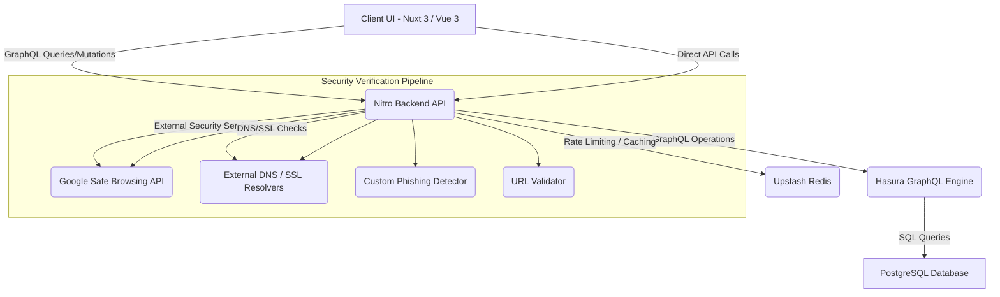

<!--
  Generated by AI-Powered README Generator
  Repository: https://github.com/WomB0ComB0/link-shortener
  Generated: 2025-11-19T01:19:43.155Z
  Format: md
  Style: comprehensive
-->

# 🔗 LinkShort - Secure, Type-Safe Link Shortener

[](https://github.com/WomB0ComB0/link-shortener/actions/workflows/ci.yml)
[](https://github.com/WomB0ComB0/link-shortener/blob/main/LICENSE)
[](https://github.com/WomB0ComB0/link-shortener)
[](https://github.com/WomB0ComB0/link-shortener)

**The modern, enterprise-grade solution for secure link management, real-time analytics, and unparalleled type-safety.**

---

## 🧭 Table of Contents

*   [Overview](#overview)
*   [Feature Highlights](#feature-highlights)
*   [Architecture & Design](#architecture-design)
    *   [High-Level Components](#high-level-components)
    *   [Technology Stack](#technology-stack)
*   [Getting Started](#getting-started)
    *   [Prerequisites](#prerequisites)
    *   [Installation](#installation)
    *   [Environment Configuration](#environment-configuration)
    *   [Database Migrations](#database-migrations)
    *   [Running the Application](#running-the-application)
        *   [Development Mode](#development-mode)
        *   [Production Mode](#production-mode)
        *   [Docker Deployment](#docker-deployment)
*   [Usage & Workflows](#usage-workflows)
    *   [Creating a Short Link](#creating-a-short-link)
    *   [API Key Management](#api-key-management)
    *   [Security Verification API](#security-verification-api)
    *   [Authentication Workflows](#authentication-workflows)
*   [Limitations, Known Issues & Future Roadmap](#limitations-known-issues--future-roadmap)
    *   [Current Limitations](#current-limitations)
    *   [Known Issues](#known-issues)
    *   [Future Roadmap](#future-roadmap)
*   [Contributing & Development Guidelines](#contributing--development-guidelines)
    *   [How to Contribute](#how-to-contribute)
    *   [Branching & Pull Request Guidelines](#branching--pull-request-guidelines)
    *   [Code Style & Quality](#code-style--quality)
    *   [Testing](#testing)
*   [License, Credits & Contact](#license-credits--contact)
    *   [License](#license)
    *   [Acknowledgments](#acknowledgments)
    *   [Maintainer & Contact](#maintainer--contact)
*   [Appendix](#appendix)
    *   [Changelog](#changelog)
    *   [Frequently Asked Questions (FAQ)](#frequently-asked-questions-faq)
    *   [Troubleshooting Guide](#troubleshooting-guide)
    *   [Detailed API Reference](#detailed-api-reference)

---

## <a id="overview"></a>✨ Overview

LinkShort is a cutting-edge link shortening service engineered for **security, performance, and developer experience**. Built with a modern tech stack including Nuxt 3, Effect Schema, and Hasura GraphQL, it offers not just robust URL shortening but also an unparalleled 5-layer security verification pipeline to protect users from malicious links.

### 🎯 Purpose & Goals

The primary goal of LinkShort is to provide a reliable, secure, and highly observable platform for managing shortened URLs. It aims to:

*   **Combat Malicious Links:** Implement proactive security checks to identify and mitigate threats like phishing, malware, and other deceptive practices.
*   **Ensure Data Integrity:** Leverage powerful type-safety mechanisms across the entire application stack for robust and error-free operations.
*   **Provide Actionable Insights:** Offer detailed analytics for shortened links, empowering users to understand their audience and link performance.
*   **Deliver a Seamless User Experience:** Offer a fast, responsive, and intuitive interface with PWA capabilities.

### 💡 Why It Matters / Problem It Solves

In an era of increasing cyber threats, traditional link shorteners often lack the necessary security measures, exposing users to risks. LinkShort addresses this by:

*   **Preventing Phishing & Malware:** Actively scanning and scoring URLs for potential threats *before* they are shortened or redirected, protecting end-users.
*   **Enhancing Trust:** Providing transparent security reports for each link, building confidence in shared URLs.
*   **Streamlining Development:** Using advanced type-safety ensures fewer bugs and faster development cycles, leading to a more stable and reliable service.

### 🧑‍💻 Target Audience

*   **Developers:** Seeking a secure, modern, and extensible link shortening solution for their projects or internal tools.
*   **Businesses & Marketing Teams:** Requiring a reliable platform for branded links, campaign tracking, and security assurance.
*   **Security-Conscious Individuals:** Who prioritize safety and transparency when sharing or interacting with shortened URLs.

[⬆️ Back to Top](#%F0%9F%A7%B0-table-of-contents)

---

## <a id="feature-highlights"></a>🚀 Feature Highlights

LinkShort comes packed with features designed for security, efficiency, and ease of use.

### 🛡️ Advanced Security & Verification

*   ✅ **5-Layer Security Verification Pipeline:**
    *   **URL Format & Domain Validation:** Ensures correct syntax and blocks suspicious patterns.
    *   **DNS Record Verification:** Validates domain existence, type, and associated IPs.
    *   **SSL/TLS Certificate Checking:** Confirms certificate validity, expiration, and common issues.
    *   **Advanced Phishing Detection:** Employs typosquatting, homograph attack, and brand impersonation detection.
    *   **Malware Scanning:** Integrates with the Google Safe Browsing API v4 for real-time threat intelligence.
*   🔍 **Risk-Based Policies:** Links are categorized into `Safe`, `Low`, `Medium`, `High`, and `Critical` risk levels, with configurable actions (allow, warn, block).
*   ⏱️ **Real-time Threat Detection:** Security checks are performed swiftly, with results cached for efficiency (1-hour TTL).
*   📊 **Comprehensive Security Reports:** Get detailed insights into potential threats with actionable recommendations for each scanned URL.
*   ⚠️ **Rate Limiting:** Protects against abuse and DoS attacks using Upstash Redis.
*   🚫 **Banlist Management:** Prevents shortening of explicitly banned URLs or domains.

### 🔐 Uncompromising Type-Safety

*   🌟 **Effect Schema:** Utilizes the powerful Effect Schema for both runtime and compile-time validation, ensuring data integrity from API request to database.
*   🔑 **Type-Safe Authentication:** Secure, type-safe JWT-based authentication with robust password hashing (SHA-256) and validation.
*   ⚛️ **Type-Safe GraphQL:** Seamlessly integrates with Hasura GraphQL, providing end-to-end type safety for all data operations.
*   ✉️ **Email & Password Validation:** Enforces strong password policies (8+ chars, uppercase, lowercase, number) and RFC-compliant email validation.

### 👤 Robust User Management

*   🚪 **User Authentication:** Secure JWT-based registration and login system.
*   🔄 **Session Management:** Handles JWT token validation and expiration.
*   🔒 **Protected Routes:** Ensures only authenticated users can access sensitive features and data.
*   🔑 **API Key Management:** Generate, list, and revoke API keys for programmatic access to the LinkShort service.

### 📈 Analytics & Customization

*   📊 **Click Tracking:** Monitor the number of clicks each shortened link receives.
*   🕵️ **User Agent & Referrer Tracking:** Understand your audience's devices and where their clicks originate.
*   🌍 **Geographic Data:** Basic IP-based location tracking for aggregated analytics.
*   ✍️ **Custom Link Aliases:** Personalize shortened links with memorable, custom slugs.
*   🗓️ **Expiration Dates:** Set automatic expiration for links, ideal for time-sensitive campaigns.

### 🎨 Modern User Experience

*   🚀 **Nuxt 3 & Vue 3:** A blazing-fast, responsive frontend built with the latest technologies.
*   🌙 **Dark Mode Support:** A comfortable viewing experience in any lighting condition.
*   📱 **Responsive Design:** Optimized for mobile, tablet, and desktop devices.
*   🌐 **Progressive Web App (PWA):** Installable and accessible offline for enhanced user experience.
*   📋 **Copy-to-Clipboard:** Quick and easy copying of shortened URLs with visual feedback.
*   ✅ **Real-time Feedback:** Clear loading states, error handling, and security verification displays.

[⬆️ Back to Top](#%F0%9F%A7%B0-table-of-contents)

---

## <a id="architecture-design"></a>🏗️ Architecture & Design

LinkShort is built on a modular, API-first architecture designed for scalability, security, and maintainability. It leverages a modern Jamstack-like approach with a powerful Nitro backend.

### <a id="high-level-components"></a>High-Level Components

The application's core architecture can be visualized as follows:



#### Component Responsibilities:

*   **Client UI (Nuxt 3 / Vue 3):**
    *   Provides the interactive web interface for users to shorten links, view analytics, manage API keys, and authenticate.
    *   Handles client-side routing, state management, and interaction logic.
    *   Utilizes Nuxt UI for a consistent and modern look and feel.
*   **Nitro Backend API (Deno Runtime):**
    *   The universal server layer provided by Nuxt 3, running on Deno for enhanced performance and security.
    *   Exposes RESTful API endpoints for link creation, authentication, security verification, and analytics.
    *   Orchestrates the 5-layer security verification pipeline.
    *   Communicates with Hasura GraphQL, Upstash Redis, and external security APIs.
    *   Implements rate limiting, authentication middleware, and data validation using Effect Schema.
*   **Hasura GraphQL Engine:**
    *   Provides instant, real-time GraphQL APIs over PostgreSQL.
    *   Handles data fetching, filtering, and mutations based on permissions.
    *   Acts as the primary interface between the Nitro backend and the PostgreSQL database.
*   **PostgreSQL Database:**
    *   The persistent data store for all application data, including users, links, analytics, and API keys.
    *   Managed through Railway for scalable and reliable hosting.
*   **Upstash Redis:**
    *   A serverless Redis instance used for high-performance caching and rate limiting.
    *   Crucial for preventing API abuse and ensuring quick access to frequently requested data (e.g., security check results).
*   **Google Safe Browsing API:**
    *   An external API used by the security pipeline to check URLs against Google's constantly updated lists of unsafe web resources.
*   **External DNS / SSL Resolvers:**
    *   Services used by the security pipeline to perform DNS record lookups and SSL/TLS certificate validations for target URLs.
*   **Custom Phishing Detector & URL Validator:**
    *   Internal modules within the Nitro backend responsible for advanced analysis like typosquatting, homograph detection, and comprehensive URL syntax and content validation.

### <a id="technology-stack"></a>Technology Stack

| Category             | Technology             | Description                                                                 |
| :------------------- | :--------------------- | :-------------------------------------------------------------------------- |
| **Frontend**         | Nuxt 3, Vue 3          | Intuitive Vue Framework for SSR, SPA, and SSG.                              |
|                      | Nuxt UI, Tailwind CSS  | Modern UI components and utility-first CSS framework for styling.           |
| **Backend / Runtime**| Nitro, H3              | Nuxt's server engine and HTTP framework, providing API routes and middleware. |
|                      | Deno                   | Secure JavaScript/TypeScript runtime powering the backend.                  |
| **Database**         | Railway PostgreSQL     | Scalable and reliable relational database.                                  |
| **GraphQL Layer**    | Hasura                 | Instant GraphQL APIs over PostgreSQL for efficient data access.             |
| **Caching / Queueing**| Upstash Redis          | Serverless Redis for rate limiting, caching, and transient data storage.    |
| **Security APIs**    | Google Safe Browsing v4| External API for malware and phishing detection.                            |
| **Authentication**   | JWT, SHA-256           | JSON Web Tokens for secure user sessions, SHA-256 for password hashing.     |
| **Type Safety**      | Effect Schema          | Comprehensive runtime and compile-time data validation.                     |
|                      | TypeScript             | Superset of JavaScript for robust, type-safe development.                   |
| **Containerization** | Docker, Docker Compose | For packaging and deploying the application and its services.               |

[⬆️ Back to Top](#%F0%9F%A7%B0-table-of-contents)

---

## <a id="getting-started"></a>🚀 Getting Started

Follow these steps to get LinkShort up and running on your local machine for development or production.

### <a id="prerequisites"></a>Prerequisites

Before you begin, ensure you have the following installed:

*   **Node.js**: Version 22.x or higher.
    *   _Verification:_ `node -v`
*   **Deno**: Used as the runtime for the Nitro backend (optional if using Node.js, but recommended for development).
    *   _Verification:_ `deno -v`
*   **Git**: For cloning the repository.
    *   _Verification:_ `git --version`
*   **Docker & Docker Compose**: (Recommended for production deployment)
    *   _Verification:_ `docker -v`, `docker compose -v`

You'll also need accounts and credentials for the following services:

*   **Railway**: For hosting PostgreSQL and Hasura.
*   **Upstash**: For a Redis instance (rate limiting).
*   **Google Cloud**: (Optional, but highly recommended for full security features) To obtain a Google Safe Browsing API Key.

### <a id="installation"></a>Installation

1.  **Clone the repository:**

    ```bash
    git clone https://github.com/WomB0ComB0/link-shortener.git
    cd link-shortener
    ```

2.  **Install project dependencies:**

    ```bash
    npm install
    # Or using pnpm/yarn:
    # pnpm install
    # yarn install
    ```

3.  **Copy environment variables:**
    Create a `.env` file from the example and fill in your credentials.

    ```bash
    cp .env.example .env
    ```

### <a id="environment-configuration"></a>Environment Configuration

Open the newly created `.env` file and populate it with your service credentials.

<details>
<summary>Click to expand environment variable details</summary>

```ini
# --- Core Application Settings ---
# A secure, random string (at least 32 characters) used for JWT signing.
# GENERATE_PASSWORD_HASH SCRIPT (scripts/generate-password-hash.mjs) can assist with generating secure secrets.
JWT_SECRET=your_secure_random_string_at_least_32_chars

# --- Database & GraphQL (Railway PostgreSQL + Hasura) ---
# The endpoint for your Hasura GraphQL API.
HASURA_GRAPHQL_ENDPOINT=https://your-project.hasura.app/v1/graphql
# The admin secret for your Hasura instance. Keep this highly secure!
HASURA_ADMIN_SECRET=your_hasura_admin_secret

# --- Caching & Rate Limiting (Upstash Redis) ---
# The REST URL for your Upstash Redis instance.
UPSTASH_REDIS_REST_URL=https://your-redis.upstash.io
# The authentication token for your Upstash Redis instance.
UPSTASH_REDIS_REST_TOKEN=your_upstash_token

# --- Security Verification (Google Safe Browsing API) ---
# Your Google Safe Browsing API key. Required for malware detection.
# If omitted, malware scanning will be disabled.
GOOGLE_SAFE_BROWSING_API_KEY=your_google_api_key

# --- Optional Security & Development Flags ---
# Enable/disable the entire security verification pipeline. Defaults to true.
SECURITY_VERIFICATION_ENABLED=true
# Time-to-live (in seconds) for security check results cache. Defaults to 3600 (1 hour).
SECURITY_CACHE_TTL=3600
# Timeout (in milliseconds) for individual security checks. Defaults to 10000 (10 seconds).
SECURITY_CHECK_TIMEOUT=10000
# A secret string that allows bypassing security checks for specific requests (development only).
# Do NOT use in production unless you fully understand the risks.
ADMIN_BYPASS_SECRET=your_development_bypass_secret

# --- PWA Settings (if applicable) ---
# Base URL for PWA assets.
# APP_BASE_URL=https://linkshort.example.com
```
</details>

### <a id="database-migrations"></a>Database Migrations

If you are setting up a new database or updating an existing one, you'll need to apply the migrations. LinkShort uses SQL migrations located in the `migrations/` directory.

<details>
<summary>Click to expand database migration steps</summary>

The migration files (`001_initial_schema.sql`, etc.) are designed to be applied directly to your PostgreSQL database.
You can use a database client or the Hasura console to run these.

1.  **Access your PostgreSQL Database:**
    Connect to your Railway-hosted PostgreSQL database using a tool like `psql`, DBeaver, or pgAdmin, or directly via the Railway dashboard's database tab.

2.  **Apply Migrations:**
    Execute the SQL scripts in the `migrations/` directory in sequential order.

    *   `001_initial_schema.sql`: Sets up the initial tables (`users`, `links`, `api_keys`, `analytics`).
    *   `002_add_user_authentication.sql`: Adds necessary columns or indexes for authentication features.
    *   `003_cascade_user_deletions.sql`: Configures foreign key constraints for cascading deletions.

    Example (using `psql`):
    ```bash
    psql -h <your_db_host> -U <your_db_user> -d <your_db_name> -f migrations/001_initial_schema.sql
    psql -h <your_db_host> -U <your_db_user> -d <your_db_name> -f migrations/002_add_user_authentication.sql
    psql -h <your_db_host> -U <your_db_user> -d <your_db_name> -f migrations/003_cascade_user_deletions.sql
    ```

3.  **Configure Hasura:**
    After applying migrations, ensure Hasura is synchronized with your database schema. You might need to "Track all tables/views/functions" from the Hasura Console if it's a fresh setup. This allows Hasura to automatically generate GraphQL operations for your new tables.

</details>

### <a id="running-the-application"></a>Running the Application

#### <a id="development-mode"></a>Development Mode

To start the development server with hot-reloading:

```bash
npm run dev
```

The application will be accessible at `http://localhost:3000`.

#### <a id="production-mode"></a>Production Mode

To build the application for production:

```bash
npm run build
```

To preview the production build locally:

```bash
npm run preview
```

This will start a local server serving the optimized production assets.

#### <a id="docker-deployment"></a>Docker Deployment

LinkShort includes a `Dockerfile` and `docker-compose.yml` for easy containerization and deployment.

1.  **Build Docker Images:**

    ```bash
    docker compose build
    ```

2.  **Run with Docker Compose:**

    ```bash
    docker compose up -d
    ```

    This will start the LinkShort application, exposing it on port `3000`. Ensure your `.env` file is correctly configured before running, as it will be used by the Docker container.

[⬆️ Back to Top](#%F0%9F%A7%B0-table-of-contents)

---

## <a id="usage-workflows"></a>🎯 Usage & Workflows

LinkShort offers various ways to interact with its services, from the user-friendly UI to powerful API endpoints.

### <a id="creating-a-short-link"></a>Creating a Short Link

You can create short links via the web UI or directly through the API.

#### Web UI

1.  Navigate to the `/create` page.
2.  Enter your original long URL.
3.  (Optional) Provide a custom alias (e.g., `my-link`) for a more memorable short URL.
4.  (Optional) Set an expiration date.
5.  Click "Shorten." The system will perform security checks and provide a shortened URL and a security report.

#### API Endpoint

Authenticated users can programmatically create links.

```bash
POST /api/links/create
```

**Request Body Example:**

```json
{
  "originalUrl": "https://www.example.com/very/long/path/to/my/content?param=value&id=123",
  "customAlias": "my-example-link",  // Optional: must be unique and alphanumeric/hyphenated
  "expiresAt": "2025-12-31T23:59:59Z" // Optional: ISO 8601 format
}
```

**Response Example (Success):**

```json
{
  "id": "abcde",
  "shortUrl": "https://yourdomain.com/abcde",
  "originalUrl": "https://www.example.com/...",
  "customAlias": "my-example-link",
  "expiresAt": "2025-12-31T23:59:59Z",
  "createdAt": "2024-01-20T10:00:00Z",
  "securityReport": {
    "riskLevel": "Safe",
    "score": 10,
    "checks": {
      "urlValidation": { "status": "passed", "details": "Valid URL format." },
      "dnsVerification": { "status": "passed", "details": "DNS records found." },
      "sslChecking": { "status": "passed", "details": "Valid SSL certificate." },
      "phishingDetection": { "status": "passed", "details": "No phishing patterns detected." },
      "malwareScanning": { "status": "passed", "details": "No malware detected." }
    },
    "recommendations": []
  }
}
```

### <a id="api-key-management"></a>API Key Management

Authenticated users can generate and manage API keys to integrate LinkShort into their applications.

#### Create API Key

```bash
POST /api/keys/create
```

**Request Body Example:**

```json
{
  "name": "My Integration Key",
  "expiresAt": "2026-01-01T00:00:00Z" // Optional
}
```

**Response Example (Success):**

```json
{
  "id": "key_uuid",
  "name": "My Integration Key",
  "apiKey": "LSK_YOUR_GENERATED_API_KEY_HERE", // IMPORTANT: This is shown ONLY ONCE
  "createdAt": "2024-01-20T10:00:00Z",
  "expiresAt": "2026-01-01T00:00:00Z"
}
```
💡 **Important:** The `apiKey` is sensitive and will only be shown in the response immediately after creation. Store it securely.

#### List API Keys

```bash
GET /api/keys/list
```

**Response Example:**

```json
[
  {
    "id": "key_uuid_1",
    "name": "My Integration Key",
    "createdAt": "2024-01-20T10:00:00Z",
    "expiresAt": "2026-01-01T00:00:00Z",
    "lastUsedAt": "2024-01-20T11:30:00Z"
  },
  {
    "id": "key_uuid_2",
    "name": "Another Service Key",
    "createdAt": "2024-01-20T12:00:00Z",
    "expiresAt": null,
    "lastUsedAt": null
  }
]
```

#### Revoke API Key

```bash
POST /api/keys/revoke
```

**Request Body Example:**

```json
{
  "keyId": "key_uuid_to_revoke"
}
```

### <a id="security-verification-api"></a>Security Verification API

You can explicitly verify the security status of any URL using the dedicated API endpoint.

```bash
GET /api/security/verify?url=https://example.com
```

**Example CLI Usage:**

```bash
# Safe URL
curl "http://localhost:3000/api/security/verify?url=https://google.com"

# Phishing patterns (example, actual detection varies)
curl "http://localhost:3000/api/security/verify?url=https://paypal-secure-login.tk"

# Malicious URL (requires Google Safe Browsing API key)
curl "http://localhost:3000/api/security/verify?url=http://malware.testing.google.test/testing/malware/"
```

**Response Structure:**

```json
{
  "url": "https://example.com",
  "riskLevel": "Safe", // "Safe", "Low", "Medium", "High", "Critical"
  "score": 10,         // Numerical risk score (0-100)
  "checks": {
    "urlValidation": {
      "status": "passed",
      "details": "URL is valid and conforms to expected patterns."
    },
    "dnsVerification": {
      "status": "passed",
      "details": "DNS records (A, MX, CNAME) were successfully resolved.",
      "data": { "a_records": ["172.67.73.116"], "mx_records": ["mx.example.com"] }
    },
    "sslChecking": {
      "status": "passed",
      "details": "SSL certificate is valid and unexpired.",
      "data": { "issuer": "Let's Encrypt", "expires": "2025-01-01T00:00:00Z" }
    },
    "phishingDetection": {
      "status": "passed",
      "details": "No signs of typosquatting, homograph attacks, or brand impersonation.",
      "data": { "typosquatting_score": 0.0, "homograph_score": 0.0 }
    },
    "malwareScanning": {
      "status": "passed",
      "details": "Google Safe Browsing API found no threats.",
      "data": { "threatTypes": [] }
    }
  },
  "recommendations": [
    // Array of strings if any recommendations are applicable
  ]
}
```

### <a id="authentication-workflows"></a>Authentication Workflows

LinkShort uses JWT-based authentication for user sessions.

#### Register New User

```bash
POST /api/auth/register
```

**Request Body:**

```json
{
  "email": "user@example.com",
  "password": "StrongPassword123!"
}
```

#### Login User

```bash
POST /api/auth/login
```

**Request Body:**

```json
{
  "email": "user@example.com",
  "password": "StrongPassword123!"
}
```

**Response (Login/Register Success):**

```json
{
  "user": {
    "id": "user_uuid",
    "email": "user@example.com",
    "createdAt": "2024-01-20T10:00:00Z"
  },
  "token": "YOUR_JWT_TOKEN_HERE" // Store this token securely (e.g., in HttpOnly cookie or localStorage)
}
```

#### Get Current User (Protected Route)

This endpoint requires a valid JWT in the `Authorization` header.

```bash
GET /api/auth/me
```

**Request Header:**

```
Authorization: Bearer YOUR_JWT_TOKEN_HERE
```

**Response:**

```json
{
  "id": "user_uuid",
  "email": "user@example.com",
  "createdAt": "2024-01-20T10:00:00Z",
  "linksCount": 5
}
```

[⬆️ Back to Top](#%F0%9F%A7%B0-table-of-contents)

---

## <a id="limitation-known-issues--future-roadmap"></a>⚠️ Limitations, Known Issues & Future Roadmap

### <a id="current-limitations"></a>Current Limitations

*   **Reliance on External APIs:** Full security features depend on Google Safe Browsing API availability and rate limits.
*   **IP-based Geo-data:** Geographic analytics are based on IP addresses, which can be less accurate than other methods and are subject to privacy considerations.
*   **No Link Editing Post-Creation:** Currently, links cannot be edited after they are created (e.g., changing original URL or custom alias).
*   **Simple Analytics:** Analytics currently focus on basic click metrics, user agent, and referrer, without deeper drill-down capabilities.
*   **Single User per Email:** The system currently assumes a one-to-one relationship between an email and a user account.

### <a id="known-issues"></a>Known Issues

*   **Occasional API Timeouts:** Under heavy load or with slow external API responses, security checks might occasionally time out, resulting in incomplete reports. (Mitigation: Increase `SECURITY_CHECK_TIMEOUT` in `.env`).
*   **PWA Cache Invalidation:** Updates to the PWA might sometimes require a manual cache clear by the user, especially for critical asset changes.

### <a id="future-roadmap"></a>Future Roadmap

We're constantly working to improve LinkShort. Here's a glimpse of what's planned:

*   **Advanced Analytics Dashboard:**
    *   Interactive charts for click trends over time.
    *   Detailed referrer breakdowns.
    *   Device type and OS statistics.
    *   Heatmaps for geographic data.
*   **Custom Domain Support:** Allow users to connect their own domains (e.g., `s.yourbrand.com`) for branded shortened links.
*   **Link Editing and Management:**
    *   Ability to modify the original URL, custom alias, or expiration date for existing links.
    *   Bulk link management features.
*   **Webhooks for Link Events:** Notify external systems on link creation, click, or expiration events.
*   **Team Collaboration:** Features for multiple users to manage links under a single organizational account.
*   **QR Code Generation:** Automatically generate QR codes for shortened links.
*   **Enhanced API Key Scopes:** Granular permissions for API keys (e.g., read-only, link creation only).
*   **Expanded Security Checks:** Integration with more threat intelligence sources or custom rule definitions.

[⬆️ Back to Top](#%F0%9F%A7%B0-table-of-contents)

---

## <a id="contributing--development-guidelines"></a>🤝 Contributing & Development Guidelines

We welcome contributions from the community! Whether it's reporting bugs, suggesting features, or submitting code, your help is valuable.

### <a id="how-to-contribute"></a>How to Contribute

1.  **Fork the repository:** Start by forking the [LinkShort repository](https://github.com/WomB0ComB0/link-shortener) to your GitHub account.
2.  **Clone your fork:**
    ```bash
    git clone https://github.com/YOUR_USERNAME/link-shortener.git
    cd link-shortener
    ```
3.  **Create a new branch:** For each new feature or bug fix, create a dedicated branch.
    ```bash
    git checkout -b feature/your-feature-name # for new features
    git checkout -b bugfix/issue-description  # for bug fixes
    ```
4.  **Make your changes:** Implement your feature or fix the bug.
5.  **Test your changes:** Ensure your changes work as expected and don't introduce regressions.
6.  **Commit your changes:** Write clear and concise commit messages.
    ```bash
    git commit -m "feat: Add amazing new feature"
    git commit -m "fix: Resolve critical bug in XYZ"
    ```
7.  **Push to your fork:**
    ```bash
    git push origin feature/your-feature-name
    ```
8.  **Open a Pull Request:** Go to the original LinkShort repository on GitHub and open a pull request from your branch.

### <a id="branching--pull-request-guidelines"></a>Branching & Pull Request Guidelines

*   **Branch Naming:** Use `feature/` for new features, `bugfix/` for bug fixes, `refactor/` for code refactorings, and `docs/` for documentation changes.
*   **Pull Request Title:** Should be descriptive and concisely summarize the changes.
*   **Pull Request Description:** Provide a detailed explanation of your changes, why they were made, any relevant context, and reference any issues they resolve (e.g., `Closes #123`).
*   **Code Review:** Be prepared for constructive feedback and be willing to iterate on your changes.

### <a id="code-style--quality"></a>Code Style & Quality

*   **TypeScript:** All new code should be written in TypeScript, leveraging its type-safety features.
*   **Linting & Formatting:** Adhere to the existing code style. The project uses `eslint` and `prettier` (configured in `deno.json`, `package.json`, `vitest.config.ts`, `tsconfig.json`). Ensure your code passes linting checks before submitting.
    ```bash
    # Check for linting errors
    npm run lint

    # Automatically fix linting and formatting errors
    npm run format
    ```
*   **Effect Schema:** Utilize Effect Schema for all data validation, both on the frontend and backend API layers.

### <a id="testing"></a>Testing

*   **Unit & Integration Tests:** If applicable, write tests for new features and bug fixes. The project uses `Vitest` for testing.
*   **Test Command:**
    ```bash
    npm run test
    ```
*   **Security Testing:** When developing security-related features, consider edge cases and potential vulnerabilities. The `/api/security/verify` endpoint is excellent for testing different URL patterns.

[⬆️ Back to Top](#%F0%9F%A7%B0-table-of-contents)

---

## <a id="license-credits--contact"></a>©️ License, Credits & Contact

### <a id="license"></a>License

Copyright © 2025 Mike Odnis. All rights reserved.

This project is not currently under an explicit open-source license. Please contact the maintainer for licensing inquiries or to request permission for commercial use.

### <a id="acknowledgments"></a>Acknowledgments

LinkShort is made possible by the incredible work of the open-source community and various services:

*   [**Nuxt**](https://nuxt.com/) - The Intuitive Vue Framework that powers the frontend and server.
*   [**Effect**](https://effect.website/) - A powerful TypeScript library enabling robust functional programming and type safety.
*   [**Hasura**](https://hasura.io/) - For providing instant, real-time GraphQL APIs over our database.
*   [**Railway**](https://railway.app/) - Our preferred platform for seamless infrastructure deployment.
*   [**Upstash**](https://upstash.com/) - For serverless Redis, crucial for rate limiting and caching.
*   [**Google Safe Browsing**](https://safebrowsing.google.com/) - A vital component of our threat detection pipeline.
*   [**Mermaid JS**](https://mermaid.js.org/) - For diagramming in Markdown.

### <a id="maintainer--contact"></a>Maintainer & Contact

This project is actively maintained by:

*   **Mike Odnis** ([@WomB0ComB0](https://github.com/WomB0ComB0)) - Project Lead

For questions, feedback, or collaborations, please open an issue on the [GitHub repository](https://github.com/WomB0ComB0/link-shortener/issues) or reach out via GitHub.

[⬆️ Back to Top](#%F0%9F%A7%B0-table-of-contents)

---

## <a id="appendix"></a>📚 Appendix

### <a id="changelog"></a>Changelog

<details>
<summary>Click to view recent updates</summary>

**v1.0.0 - Initial Release (YYYY-MM-DD)**
*   Core Link Shortening functionality.
*   5-Layer Security Verification Pipeline implemented.
*   User Authentication (Register, Login, JWT).
*   Basic Analytics (Click, UA, Referrer).
*   Nuxt 3 & Effect Schema integration.
*   Docker support.

**Upcoming - v1.1.0 (Planned)**
*   API Key Management interface.
*   Advanced Analytics Dashboard.
*   Performance optimizations.

</details>

### <a id="frequently-asked-questions-faq"></a>Frequently Asked Questions (FAQ)

<details>
<summary>What is Effect Schema and why is it used?</summary>
Effect Schema is a powerful TypeScript library for defining runtime and compile-time data schemas. We use it to ensure that all data flowing through our application (from API requests to database interactions) is strictly typed and validated, preventing common bugs and improving code reliability and maintainability. It integrates seamlessly with our backend and frontend, providing end-to-end type safety.
</details>

<details>
<summary>How does the 5-layer security verification pipeline work?</summary>
When a URL is submitted for shortening (or directly for verification), it undergoes a series of checks:
1.  **URL Validation:** Basic syntax, protocol, and suspicious pattern detection.
2.  **DNS Verification:** Checks if the domain exists and resolves correctly, looking for unusual configurations.
3.  **SSL/TLS Checking:** Verifies the SSL certificate's validity, expiry, and potential issues.
4.  **Phishing Detection:** Advanced algorithms detect typosquatting (e.g., `paypa1.com`), homograph attacks (Unicode lookalikes), and brand impersonation.
5.  **Malware Scanning:** The URL is sent to the Google Safe Browsing API for real-time checks against known lists of unsafe web resources.
Each check contributes to a risk score, determining the final `riskLevel` and associated actions.
</details>

<details>
<summary>Can I use my own domain for shortened links?</summary>
Currently, custom domain support is on the roadmap. For now, all shortened links will use the domain where LinkShort is deployed.
</details>

<details>
<summary>What happens if a link is detected as 'High' or 'Critical' risk?</summary>
*   **High Risk:** By default, anonymous users will be blocked from accessing the link, while authenticated users will be allowed with a prominent warning.
*   **Critical Risk:** These links are blocked for ALL users, regardless of authentication status, to ensure maximum safety.
These policies can be configured on the server side if needed.
</details>

### <a id="troubleshooting-guide"></a>Troubleshooting Guide

<details>
<summary>My application isn't starting, or I'm seeing environment variable errors.</summary>
*   **Check `.env` file:** Ensure you have copied `.env.example` to `.env` and filled in all required variables correctly. Pay close attention to `JWT_SECRET`, `HASURA_GRAPHQL_ENDPOINT`, `HASURA_ADMIN_SECRET`, and `UPSTASH_REDIS_REST_URL`/`TOKEN`.
*   **Verify service credentials:** Double-check that your Hasura, Railway, Upstash, and Google API keys/secrets are correct and have the necessary permissions.
*   **Node.js/Deno version:** Ensure you're running Node.js 22.x+ or a compatible Deno version.
*   **Port conflicts:** If you're running another service on port `3000`, the application might fail to start. Try stopping the other service or changing the port in `nuxt.config.ts`.
</details>

<details>
<summary>Security verification is slow or not working for malware detection.</summary>
*   **Google Safe Browsing API Key:** Malware scanning requires a valid `GOOGLE_SAFE_BROWSING_API_KEY` in your `.env`. If this is missing or invalid, the malware check will be skipped or fail.
*   **Network connectivity:** Ensure your server has outbound access to Google's API endpoints.
*   **Timeout settings:** Increase `SECURITY_CHECK_TIMEOUT` in your `.env` if checks are consistently timing out.
*   **API Rate Limits:** Google Safe Browsing API has rate limits. If you're making too many requests too quickly, your requests might be throttled.
</details>

<details>
<summary>My database tables are missing or not accessible via Hasura.</summary>
*   **Run Migrations:** Ensure you've applied all SQL migration files from the `migrations/` directory to your PostgreSQL database. Refer to the [Database Migrations](#database-migrations) section.
*   **Hasura Console:** Log into your Hasura Console and verify that your tables (`users`, `links`, `api_keys`, `analytics`) are "tracked." If not, track them manually.
*   **Permissions:** For development, ensure your `HASURA_ADMIN_SECRET` is correctly set. For production, ensure appropriate user permissions are configured in Hasura.
</details>

### <a id="detailed-api-reference"></a>Detailed API Reference

While this README provides key examples, you can explore all available API endpoints and their schemas within the `server/api/` directory.

*   `server/api/[code].get.ts`: Handles redirection for shortened links.
*   `server/api/auth/`: User authentication (login, register, me).
*   `server/api/keys/`: API key management (create, list, revoke).
*   `server/api/links/`: Link management (create, analytics, user's links).
*   `server/api/security/verify.get.ts`: Dedicated endpoint for security verification.

Each endpoint includes Effect Schema definitions for request and response bodies, providing comprehensive type documentation.

[⬆️ Back to Top](#%F0%9F%A7%B0-table-of-contents)