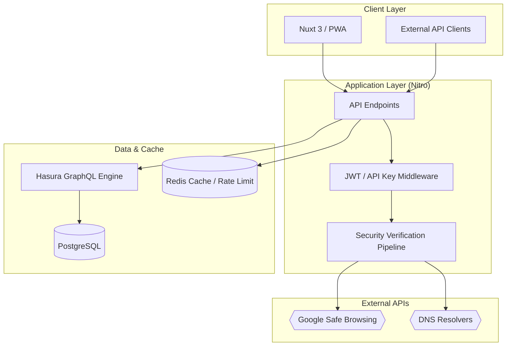
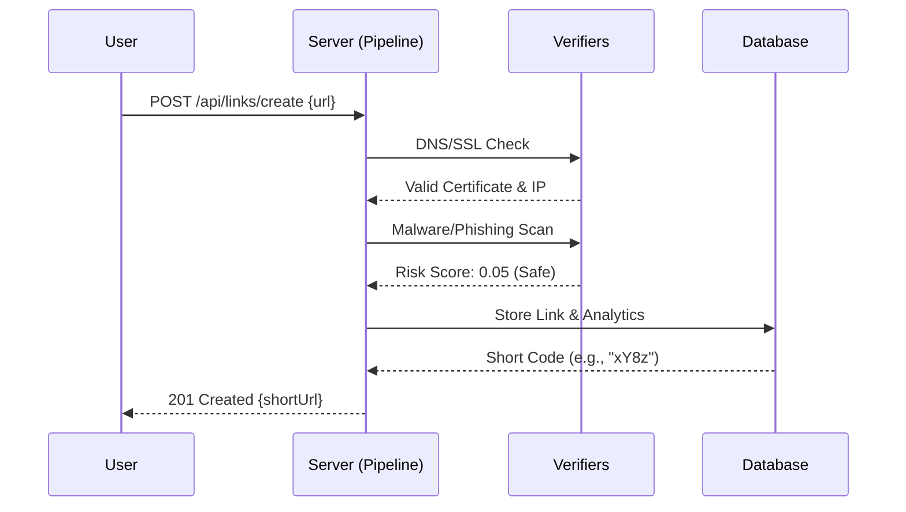

<!--
  Generated by AI-Powered README Generator
  Repository: https://github.com/WomB0ComB0/link-shortener
  Generated: 2026-01-07T07:38:02.849Z
  Format: md
  Style: comprehensive
-->

# LinkShort - Secure, Type-Safe Link Shortener

The modern, enterprise-grade solution for secure link management, real-time analytics, and five-layer threat detection.


## Table of Contents
- [Overview](#overview)
- [Features](#features)
- [Architecture](#architecture)
- [Quick Start](#quick-start)
- [Usage & Examples](#usage--examples)
- [Configuration](#configuration)
- [API Reference](#api-reference)
- [Development](#development)
- [Troubleshooting](#troubleshooting)
- [Security & Performance](#security--performance)
- [Contributing](#contributing)
- [Roadmap](#roadmap)
- [License & Credits](#license--credits)

## Overview

LinkShort is a high-performance URL shortening service built with **Nuxt 3**, **Effect Schema**, and **Hasura GraphQL**. Unlike traditional shorteners, LinkShort prioritizes the safety of the end-user by passing every submitted URL through a rigorous 5-layer security verification pipeline. 

The project solves the "Blind Click" problem—where users are redirected to unknown, potentially malicious destinations—by providing real-time threat scores, SSL verification, and phishing detection before a link is even generated.

**Who is this for?**
- **Security Teams:** Organizations requiring internal link management with malware protection.
- **Developers:** Teams needing a robust, type-safe API for programmatically managing short links.
- **Privacy Advocates:** Users who want transparent security reports for every link they share.

## Features

### 🛡️ Security First
- **5-Layer Verification:** Checks URL format, DNS records, SSL/TLS validity, brand impersonation (phishing), and malware databases (Google Safe Browsing).
- **Risk-Based Policies:** Categorizes links into Safe, Low, Medium, High, and Critical risk levels.
- **Rate Limiting:** Sliding window rate limiting via Redis to prevent brute-force attacks and abuse.
- **Domain Banlist:** Global and local domain blacklisting.

### ⚡ Developer Experience
- **End-to-End Type Safety:** Powered by Effect Schema and TypeScript for predictable runtime behavior.
- **GraphQL Integration:** Seamless data orchestration using Hasura and PostgreSQL.
- **API Key Management:** Built-in dashboard to generate and revoke keys for headless usage.

### 📈 User Experience
- **Real-Time Analytics:** Track clicks, referrers, and user agents.
- **PWA Ready:** Installable mobile/desktop experience with offline support.
- **Modern UI:** Responsive dashboard built with Tailwind CSS and Nuxt components.

## Architecture

### System Overview
LinkShort follows a hybrid SSR architecture using Nuxt 3 (Nitro) as the primary application server, interacting with Hasura for persistent storage and Redis for high-speed caching and rate limiting.


```mermaid
graph TD
    subgraph "Client Layer"
        UI[Nuxt 3 / PWA]
        CLI[External API Clients]
    end

    subgraph "Application Layer (Nitro)"
        API[API Endpoints]
        Pipeline[Security Verification Pipeline]
        Auth[JWT / API Key Middleware]
    end

    subgraph "Data & Cache"
        HSR[Hasura GraphQL Engine]
        DB[(PostgreSQL)]
        RDS[(Redis Cache / Rate Limit)]
    end

    subgraph "External APIs"
        GSB{{Google Safe Browsing}}
        DNS{{DNS Resolvers}}
    end

    UI --> API
    CLI --> API
    API --> Auth
    Auth --> Pipeline
    Pipeline --> GSB
    Pipeline --> DNS
    API --> HSR
    API --> RDS
    HSR --> DB
```

### Security Pipeline Sequence

```mermaid
sequenceDiagram
    participant U as User
    participant S as Server (Pipeline)
    participant V as Verifiers
    participant D as Database

    U->>S: POST /api/links/create {url}
    S->>V: DNS/SSL Check
    V-->>S: Valid Certificate & IP
    S->>V: Malware/Phishing Scan
    V-->>S: Risk Score: 0.05 (Safe)
    S->>D: Store Link & Analytics
    D-->>S: Short Code (e.g., "xY8z")
    S-->>U: 201 Created {shortUrl}
```

### Technology Stack
| Layer | Technology | Purpose |
| :--- | :--- | :--- |
| **Frontend** | Nuxt 3, Tailwind CSS | UI Framework and Styling |
| **Runtime** | Node.js / Deno | Server execution environment |
| **Database** | PostgreSQL | Persistent link and user storage |
| **API Layer** | Hasura GraphQL | High-performance data access |
| **Validation** | Effect Schema | Runtime type safety and parsing |
| **Caching** | Redis / Upstash | Rate limiting and security result caching |

## Quick Start

### Prerequisites
- Node.js >= 18.x
- Docker and Docker Compose
- A Google Safe Browsing API Key (optional but recommended)

### Installation
1. **Clone the repository:**
   ```bash
   git clone https://github.com/WomB0ComB0/link-shortener.git
   cd link-shortener
   ```

2. **Setup Environment:**
   ```bash
   cp .env.example .env
   # Edit .env with your local database and API credentials
   ```

3. **Launch Infrastructure:**
   ```bash
   docker-compose -f docker/docker-compose.yml up -d
   ```

4. **Install Dependencies & Start:**
   ```bash
   pnpm install
   pnpm dev
   ```

**Expected Output:**
The application will be available at `http://localhost:3000`. You should see the LinkShort landing page.

## Usage & Examples

### Creating a Link (CLI/Curl)
If you have generated an API key via the dashboard:

```bash
curl -X POST http://localhost:3000/api/links/create \
  -H "Authorization: Bearer YOUR_API_KEY" \
  -H "Content-Type: application/json" \
  -d '{"url": "https://example.com"}'
```

**Response:**
```json
{
  "code": "a1b2c",
  "shortUrl": "http://localhost:3000/a1b2c",
  "securityScore": "Safe"
}
```

### Advanced: Custom Expiry
<details>
<summary>Click to view custom link configuration</summary>

Currently, link expiry is managed via the database layer. You can extend the `LinkService` in `server/services/link-service.ts` to support TTLs:

```typescript
// Example snippet for link customization
const result = await linkService.createLink({
  url: "https://my-safe-site.com",
  expiresAt: new Date(Date.now() + 86400000) // 24 hours
});
```
</details>

## Configuration

### Environment Variables
| Variable | Required | Default | Description |
| :--- | :--- | :--- | :--- |
| `DATABASE_URL` | Yes | - | PostgreSQL connection string |
| `HASURA_GRAPHQL_ADMIN_SECRET` | Yes | - | Secret for Hasura API access |
| `NUXT_REDIS_URL` | Yes | - | Redis connection (Upstash or local) |
| `GOOGLE_SAFE_BROWSING_API_KEY` | No | - | API key for malware scanning |
| `JWT_SECRET` | Yes | - | Secret for signing user sessions |

## API Reference

### Auth Endpoints
- `POST /api/auth/register`: Create a new account.
- `POST /api/auth/login`: Authenticate and receive a JWT.

### Link Endpoints
| Endpoint | Method | Params | Description |
| :--- | :--- | :--- | :--- |
| `/api/links/create` | `POST` | `url` (string) | Validates and shortens a URL |
| `/api/links/me` | `GET` | - | Returns links created by the user |
| `/api/[code]` | `GET` | `code` (path) | Redirects to the target URL |
| `/api/links/analytics` | `GET` | `code` (query) | Returns click data for a code |

### Security Endpoints
- `GET /api/security/verify?url=...`: Run the 5-layer pipeline on a URL without creating a link.

## Development

### Project Structure
```text
├── app/              # Nuxt 3 Frontend (Pages, Components, Composables)
├── server/           # Nitro Backend (API Routes, Services, Security Pipeline)
├── lib/              # Shared utilities (Redis, Firebase, Fetcher)
├── migrations/       # SQL migrations for PostgreSQL
├── scripts/          # Automation and maintenance scripts
└── docker/           # Containerization configuration
```

### Running Tests
```bash
# Unit & Integration Tests (Vitest)
pnpm test

# E2E Tests (Playwright)
pnpm test:e2e
```

## Troubleshooting

| Error | Cause | Solution |
| :--- | :--- | :--- |
| `Rate limit exceeded` | Too many requests from one IP | Wait 60 seconds or increase `RATE_LIMIT_MAX` in config |
| `Insecure Link Blocked` | URL failed the SSL/Phishing check | Use `force: true` (if admin) or use a valid HTTPS URL |
| `Hasura Connection Error` | Docker containers not ready | Run `docker ps` to ensure Hasura/Postgres are running |

## Security & Performance

### Performance Considerations
- **Caching:** Security results are cached in Redis for 1 hour by default to minimize latency on frequent scans.
- **Lazy Loading:** All dashboard analytics components are lazy-loaded to keep initial bundle size small (<100kb).

### Security Notes
- **Middleware:** The `server/middleware/auth.ts` validates every request to protected routes.
- **Verification:** The `verification-pipeline.ts` uses an asynchronous design to ensure that if one scanner (e.g., DNS) hangs, it doesn't block the entire process.

## Roadmap
- [x] 5-Layer Security Pipeline
- [x] API Key Management
- [x] PWA Support
- [ ] QR Code Generation for Short Links
- [ ] Team/Organization Workspaces
- [ ] Custom Domain Support (Branded Links)

## License & Credits

**License:** Distributed under the MIT License. See `LICENSE` for more information.

**Maintainer:** [WomB0ComB0](https://github.com/WomB0ComB0)

**Acknowledgments:**
- [Nuxt.js](https://nuxt.com/) for the full-stack framework.
- [Effect](https://www.effect.website/) for the incredible schema and validation library.
- [Hasura](https://hasura.io/) for making GraphQL backends effortless.